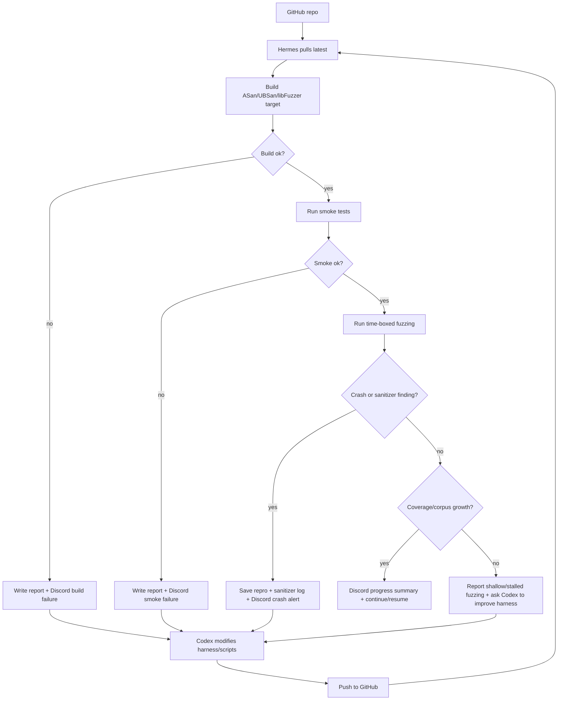

# Hermes + Codex JPEG2000 Fuzzing Automation Plan

## One-Line Goal

Build a repeatable loop where Hermes runs OpenHTJ2K decoder fuzzing, detects
crashes or useful/noisy coverage signals, alerts the user through Discord, and
hands a compact debugging report back to Codex so the harness can be improved
and pushed to GitHub for the next run.

The target repository is:

```text
https://github.com/Jseanxx/fuzzing-jpeg2000.git
```

## Desired End State

The user should be able to do this on a fuzzing machine:

```bash
git clone https://github.com/Jseanxx/fuzzing-jpeg2000.git
cd fuzzing-jpeg2000
bash scripts/build-linux-asan.sh
bash scripts/run-smoke.sh
bash scripts/run-fuzzer.sh
```

Hermes should then:

- watch the fuzz run
- detect crashes
- detect sanitizer findings
- detect whether coverage is growing
- detect whether fuzzing is stuck near early parser rejection
- write a concise report
- notify the user through Discord
- preserve crash inputs and useful logs
- give Codex enough data to modify the harness or build scripts

## Current State

Already done in this workspace:

- Minimal decoder memory harness exists:

```text
fuzz/decode_memory_harness.cpp
```

- Chosen v1 target:

```text
bytes -> openhtj2k_decoder(data, size, reduce=0, threads=1) -> parse() -> invoke()
```

- CMake fuzz harness option exists:

```text
OPENHTJ2K_FUZZ_HARNESS=ON
```

- CMake sanitizer option exists:

```text
OPENHTJ2K_FUZZ_SANITIZERS=address,undefined
```

- Proxmox/Linux ASan+UBSan smoke scripts exist:

```text
scripts/build-linux-asan.sh
scripts/run-smoke.sh
```

What is not done yet:

- a real libFuzzer executable target
- long-running fuzz script
- corpus directory layout
- coverage report script
- Hermes watcher script
- Discord notification script/webhook wrapper
- automatic `FUZZING_REPORT.md` generation
- automatic GitHub branch/PR workflow

## Important Constraint

The first harness must stay simple until the first useful metrics exist.

Do not add these yet:

- RTP receiver fuzzing
- streaming reuse fuzzing
- long-lived decoder reuse
- multi-threaded decode fuzzing
- complicated output file writing
- broad refactoring

Only add them after the batch decode harness has useful coverage/crash data.

## System Roles

### GitHub

GitHub is the source of truth for reproducible fuzzing work.

Expected repository responsibilities:

- store harness code
- store build and run scripts
- store documentation
- store seed corpus if licensing/size is acceptable
- store generated report templates
- receive harness fixes from Codex

Do not commit sensitive crash reproducers to a public repo until triaged.

### Proxmox / Linux Runner

The Proxmox machine is the main fuzzing machine.

Expected responsibilities:

- clone or pull the GitHub repo
- build with Clang/LLVM sanitizer instrumentation
- run smoke tests
- run libFuzzer campaign
- generate coverage and status artifacts
- keep local crash reproducers and corpus artifacts

Recommended packages:

```bash
sudo apt update
sudo apt install -y \
  build-essential \
  clang \
  lld \
  llvm \
  cmake \
  ninja-build \
  git \
  python3
```

### WSL

WSL can be used as a local preflight environment when Proxmox is not convenient.

WSL should run the same scripts as Proxmox where possible:

```bash
bash scripts/build-linux-asan.sh
bash scripts/run-smoke.sh
```

For serious long-running fuzzing, prefer Proxmox.

### Hermes

Hermes is the automation/orchestration agent.

Expected responsibilities:

- run commands
- monitor process output
- enforce time budgets
- collect logs and artifacts
- classify outcomes
- send Discord notifications
- create a summary report for Codex
- optionally open a GitHub issue or push an artifact branch later

Hermes should not silently ignore:

- build failures
- smoke failures
- sanitizer crashes
- libFuzzer crashes
- timeouts
- no coverage growth
- corpus not growing
- accepted/rejected ratio suggesting the harness is too shallow

### Codex

Codex is the harness/debugging engineer.

Expected responsibilities:

- read the report from Hermes
- interpret sanitizer stack traces and coverage data
- decide whether the harness or seed strategy needs changes
- make minimal code/script changes
- push updated harness to GitHub
- avoid refactoring unrelated decoder code

### Discord

Discord is the human alert channel.

Expected responsibilities:

- alert immediately on crash or sanitizer finding
- alert on build/smoke failure
- alert on long no-progress fuzzing
- send a compact summary, not full log spam
- include artifact paths and next action

## Automation Loop

The intended loop is:

1. Hermes pulls the latest repository state.
2. Hermes builds the sanitizer/libFuzzer target.
3. Hermes runs smoke tests.
4. Hermes starts a time-boxed fuzz run.
5. Hermes monitors coverage, corpus growth, crashes, and exit codes.
6. Hermes writes an artifact bundle and `FUZZING_REPORT.md`.
7. Hermes sends Discord notification.
8. If action is needed, Codex reads the report and modifies harness/scripts.
9. Codex pushes the fixed branch/version to GitHub.
10. Hermes pulls the new version and repeats.

Mermaid sketch:



## Required Metrics

Hermes should collect these every run.

### Build Metrics

```text
git commit
branch
compiler version
cmake version
build command
build flags
sanitizers enabled
target name
build exit code
```

### Smoke Metrics

```text
seed file
exit code
accepted/rejected output
stderr
runtime
```

### Fuzzing Metrics

For libFuzzer:

```text
run duration
exec/s
total executions
corpus size
new corpus units
cov
ft
rss
timeout count
crash count
```

The important libFuzzer fields are:

```text
cov  = rough coverage signal
ft   = feature coverage signal
corp = corpus size / units
exec/s = speed
```

### Harness Depth Metrics

The user specifically needs signals that say whether the harness is deep enough.

Track whether these functions are reached:

```text
open_htj2k::openhtj2k_decoder::parse()
open_htj2k::openhtj2k_decoder::invoke()
j2k_main_header::read()
j2k_tile::add_tile_part()
j2k_tile::create_tile_buf()
j2k_tile::decode()
htj2k_decode()
j2k_decode()
```

If the fuzz run does not reach tile creation or block decode, the harness or
seed corpus is probably too shallow.

### Crash Metrics

For each crash:

```text
crashing input path
reproducer command
exit code
signal
sanitizer type
top stack frames
full sanitizer log path
whether repro is stable
```

Useful sanitizer categories:

```text
heap-buffer-overflow
stack-buffer-overflow
global-buffer-overflow
heap-use-after-free
double-free
use-after-poison
container-overflow
undefined-behavior
null-dereference
integer-overflow
```

### No-Progress Metrics

If no crash occurs, Hermes should still detect whether the run is useful.

Useful "not going well" signals:

```text
cov does not increase for N minutes
ft does not increase for N minutes
corpus size does not increase for N minutes
most inputs are rejected before invoke()
no reachability into j2k_tile::decode()
exec/s is unexpectedly low
fuzzer repeatedly times out on the same path
coverage stays limited to JPH/main-header parsing
```

Suggested initial no-progress thresholds:

```text
no new coverage for 30 minutes -> Discord warning
no new coverage for 2 hours -> write report and ask Codex for harness/seed changes
no reachability beyond parse() after first corpus cycle -> ask Codex for seed/harness changes
smoke test failure -> stop immediately
crash -> stop or save and continue, depending on configured mode
```

## Discord Notification Policy

Discord messages should be short and actionable.

### Crash Alert Template

```text
[OpenHTJ2K fuzz] CRASH
repo: Jseanxx/fuzzing-jpeg2000
commit: <sha>
target: open_htj2k_decode_memory_fuzzer
sanitizer: <ASan/UBSan category>
top frame: <function/file:line if available>
repro: <local path>
log: <local path>
next: send FUZZING_REPORT.md to Codex
```

### No-Progress Alert Template

```text
[OpenHTJ2K fuzz] NO COVERAGE PROGRESS
commit: <sha>
duration: <time>
cov: <old> -> <new>
ft: <old> -> <new>
corp: <old> -> <new>
depth: <deepest reached function>
next: improve seed corpus or harness depth
```

### Build Failure Template

```text
[OpenHTJ2K fuzz] BUILD FAILED
commit: <sha>
command: <build command>
exit: <code>
log: <path>
next: Codex should inspect build log
```

### Smoke Failure Template

```text
[OpenHTJ2K fuzz] SMOKE FAILED
commit: <sha>
seed: <path>
exit: <code>
stderr: <short excerpt>
log: <path>
next: Codex should inspect harness or build flags
```

## Artifact Layout

Recommended local artifact layout on the fuzzing machine:

```text
fuzz-artifacts/
  runs/
    2026-04-14_120000_<sha>/
      build.log
      smoke.log
      fuzz.log
      FUZZING_REPORT.md
      coverage/
      crashes/
      corpus/
      reproducers/
```

Do not commit `fuzz-artifacts/` wholesale to the public repo.

Instead, use it as local evidence for Codex and only commit:

- harness changes
- scripts
- documentation
- non-sensitive minimal seeds if acceptable

## Required Scripts To Add Next

These are not implemented yet, but should be added next.

### `scripts/build-libfuzzer.sh`

Purpose:

- build the actual libFuzzer executable
- use Clang
- enable `fuzzer,address,undefined`
- keep debug info and frame pointers

Expected core flags:

```text
-fsanitize=fuzzer,address,undefined
-fno-omit-frame-pointer
-g
```

Expected CMake option:

```text
-DOPENHTJ2K_FUZZ_LIBFUZZER=ON
```

### `scripts/run-fuzzer.sh`

Purpose:

- run the libFuzzer target
- use a seed corpus
- enforce a time budget
- write logs
- save crashes

Example shape:

```bash
./build-fuzz-libfuzzer/bin/open_htj2k_decode_memory_fuzzer \
  fuzz/corpus/valid \
  -artifact_prefix=fuzz-artifacts/current/crashes/ \
  -max_total_time=3600 \
  -print_final_stats=1 \
  -use_value_profile=1
```

### `scripts/collect-coverage.sh`

Purpose:

- generate a coverage report for the harness and decoder library
- emit both human-readable summary and machine/LLM-friendly text

Potential LLVM tools:

```text
llvm-profdata
llvm-cov report
llvm-cov show
```

### `scripts/hermes-watch.sh` or `scripts/hermes_watch.py`

Purpose:

- run build/smoke/fuzzer/coverage steps
- parse logs
- classify outcome
- generate `FUZZING_REPORT.md`
- send Discord notification

Prefer Python for parsing logs and generating Markdown reports.

### `scripts/notify-discord.py`

Purpose:

- send compact Discord webhook notifications
- avoid dumping full logs into Discord
- include artifact paths and summary

Webhook URL should come from an environment variable, not a committed file:

```text
DISCORD_WEBHOOK_URL
```

## Report Template For Codex

Hermes should generate this every meaningful run:

```markdown
# FUZZING_REPORT

## Summary

- outcome:
- commit:
- branch:
- target:
- duration:
- machine:

## Build

- command:
- compiler:
- sanitizer flags:
- exit code:
- log:

## Smoke

- seeds:
- accepted:
- rejected:
- failures:
- log:

## Fuzzing

- command:
- duration:
- executions:
- exec/s:
- corpus size:
- cov:
- ft:
- crashes:
- timeouts:
- log:

## Coverage / Reachability

- reached parse:
- reached invoke:
- reached main header read:
- reached tile add:
- reached tile buf creation:
- reached tile decode:
- reached block decode:
- deepest function reached:

## Crash

- sanitizer:
- top stack:
- reproducer:
- repro command:
- full log:

## Interpretation

- likely issue:
- likely harness limitation:
- recommended Codex action:
```

## GitHub Workflow

Recommended branch flow:

```text
main
  stable scripts and docs

harness/minimal-decoder
  current v1 harness changes

harness/libfuzzer
  add real libFuzzer target and coverage/report scripts

triage/<date>-<short-sha>
  optional private/local branch for crash triage notes
```

Public repo caution:

- Do not push untriaged crashing inputs if they may disclose a real issue.
- Do push harness improvements and scripts.
- Do push documentation and reproducible build instructions.
- Consider keeping raw crash corpus on the Proxmox machine until triage.

## Phase Plan

### Phase 1 - Current

Status: mostly complete.

Deliverables:

- minimal batch decoder memory harness
- ASan/UBSan smoke build
- smoke seeds
- planning docs

### Phase 2 - libFuzzer + Metrics

Deliverables:

- `open_htj2k_decode_memory_fuzzer`
- `scripts/build-libfuzzer.sh`
- `scripts/run-fuzzer.sh`
- corpus directory
- first libFuzzer `cov`/`ft`/`corp` metrics

### Phase 3 - Coverage Report

Deliverables:

- `scripts/collect-coverage.sh`
- function reachability summary
- coverage excerpts for key decoder files
- `FUZZING_REPORT.md` generated from a run

### Phase 4 - Hermes Watcher + Discord

Deliverables:

- Hermes run wrapper
- Discord notification script
- crash/no-progress/build-fail classification
- local artifact bundle

### Phase 5 - Harness Improvement Loop

Deliverables:

- Codex reads Hermes report
- Codex modifies harness/seeds/scripts
- Codex pushes to GitHub
- Hermes reruns from fresh clone or pull
- Repeat until coverage and crash discovery improve

## Definition Of Success

The automation is working when all of these are true:

- Proxmox can clone the repo and build without manual patching.
- Smoke tests pass under ASan/UBSan.
- libFuzzer run produces `cov`, `ft`, and corpus metrics.
- Hermes can detect and report a crash.
- Hermes can detect and report no-coverage-progress.
- Discord notifications are short and actionable.
- Codex can read a generated report and decide the next harness change.
- Updated harness/scripts can be pushed to GitHub and rerun by Hermes.
